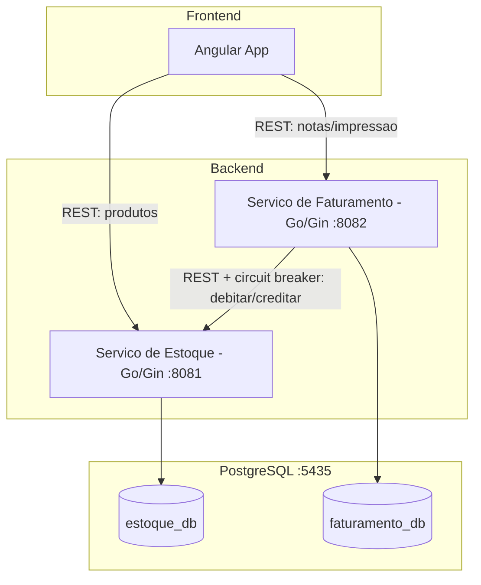
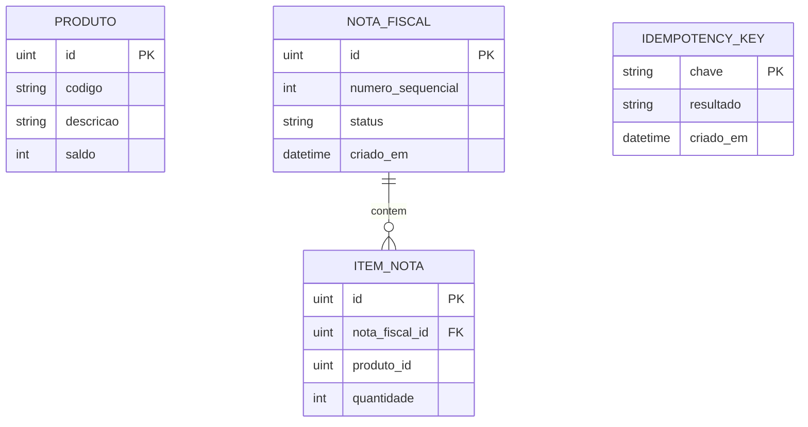
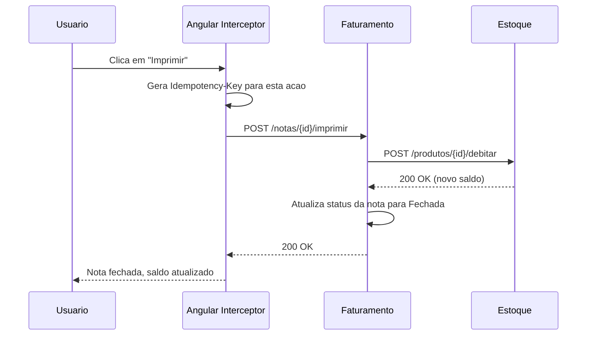
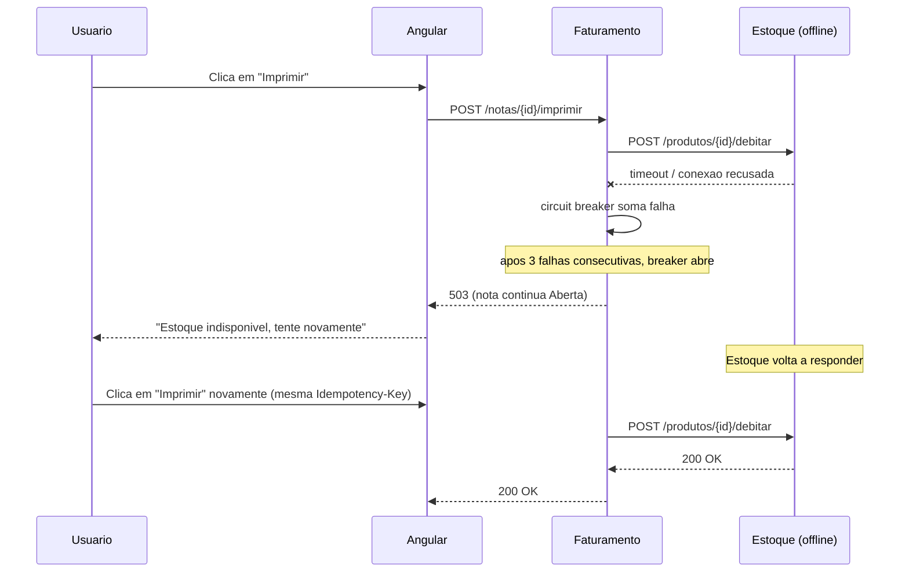

# Sistema de Emissão de Notas Fiscais

Sistema de cadastro e emissão de notas fiscais construído com dois microsserviços em **Go**, banco de dados **PostgreSQL** e frontend em **Angular**. Cobre cadastro de produtos, cadastro de notas fiscais com múltiplos itens e impressão de notas (com débito de estoque via chamada entre serviços, protegida por circuit breaker e idempotência).

**Repositório:** https://github.com/MarcosRBjunior/Korp_Teste_MarcosRibeiro

---

## Sumário

- [Stack Tecnológica](#stack-tecnológica)
- [Arquitetura](#arquitetura)
- [Modelo de Dados](#modelo-de-dados)
- [Estrutura do Repositório](#estrutura-do-repositório)
- [Endpoints da API](#endpoints-da-api)
- [Fluxos Principais](#fluxos-principais)
- [Como Rodar o Projeto](#como-rodar-o-projeto)
- [Variáveis de Ambiente](#variáveis-de-ambiente)
- [Cenários de Teste Manual](#cenários-de-teste-manual)

---

## Stack Tecnológica

| Camada | Tecnologia | Observação |
|---|---|---|
| Frontend | Angular 19 (TypeScript) | Componentes próprios inspirados em shadcn/ui (ZardUI), Tailwind CSS |
| Assíncrono no frontend | RxJS | Usado nas chamadas HTTP e no interceptor de idempotência |
| Backend | Go | Dois serviços independentes (`estoque` e `faturamento`) |
| Framework HTTP (Go) | Gin | Roteamento e handlers HTTP |
| Acesso a dados (Go) | GORM | ORM sobre PostgreSQL |
| Circuit breaker | `sony/gobreaker` | Protege a chamada do Faturamento ao Estoque |
| Banco de dados | PostgreSQL 16 (Docker) | Um banco por serviço (`estoque_db`, `faturamento_db`) |
| Orquestração local | Docker Compose | Sobe o PostgreSQL com os dois bancos já criados |

---

## Arquitetura

Dois microsserviços independentes, cada um com seu próprio banco de dados. O frontend fala diretamente com o serviço de Estoque (produtos) e com o serviço de Faturamento (notas fiscais). O Faturamento é o único que fala com o Estoque, através de um cliente HTTP protegido por circuit breaker.



**Ponto de atenção:** cada serviço tem seu próprio banco (`estoque_db` e `faturamento_db`), sem acesso direto de um serviço às tabelas do outro. A única comunicação entre os dois é via HTTP, através do cliente em `services/faturamento/internal/estoqueclient`.

---

## Modelo de Dados



`PRODUTO` vive no banco do serviço de **Estoque**. `NOTA_FISCAL`, `ITEM_NOTA` e `IDEMPOTENCY_KEY` vivem no banco do serviço de **Faturamento**. O `produto_id` em `ITEM_NOTA` é uma referência lógica, não uma foreign key de banco (os bancos são fisicamente separados).

---

## Estrutura do Repositório

```
Korp/
├── docker-compose.yml          # PostgreSQL (bancos estoque_db e faturamento_db)
├── scripts/
│   └── init-db.sql             # cria os dois bancos na primeira subida do container
├── services/
│   ├── estoque/                # microsservico Go: produtos e saldo
│   │   └── internal/
│   │       ├── config/         # leitura de variaveis de ambiente
│   │       ├── database/       # conexao GORM + migrations
│   │       ├── handlers/       # handlers HTTP (Gin)
│   │       ├── models/         # entidade Produto
│   │       └── routes/         # definicao das rotas e CORS
│   └── faturamento/            # microsservico Go: notas fiscais e impressao
│       └── internal/
│           ├── config/
│           ├── database/
│           ├── estoqueclient/  # cliente HTTP + circuit breaker para o Estoque
│           ├── handlers/
│           ├── models/         # NotaFiscal, ItemNota, IdempotencyKey
│           └── routes/
└── frontend/                   # aplicacao Angular
    └── src/app/
        ├── produtos/           # listagem e cadastro de produtos
        ├── notas/               # listagem, cadastro e impressao de notas
        ├── core/                # interceptor de Idempotency-Key
        └── shared/components/  # componentes de UI (button, table, dialog, etc.)
```

---

## Endpoints da API

### Serviço de Estoque (`http://localhost:8081`)

| Método | Rota | Descrição |
|---|---|---|
| GET | `/health` | Verifica status do serviço e da conexão com o banco |
| POST | `/produtos` | Cria um produto |
| GET | `/produtos` | Lista produtos |
| GET | `/produtos/:id` | Busca produto por id |
| POST | `/produtos/:id/debitar` | Debita saldo (uso interno, chamado pelo Faturamento) |
| POST | `/produtos/:id/creditar` | Credita saldo de volta (compensação em caso de falha) |

### Serviço de Faturamento (`http://localhost:8082`)

| Método | Rota | Descrição |
|---|---|---|
| GET | `/health` | Verifica status do serviço e da conexão com o banco |
| POST | `/notas` | Cria nota fiscal (status inicial `Aberta`) |
| GET | `/notas` | Lista notas fiscais |
| GET | `/notas/:id` | Busca nota fiscal por id |
| POST | `/notas/:id/itens` | Adiciona um item (produto + quantidade) à nota |
| POST | `/notas/:id/imprimir` | Imprime a nota: debita saldo no Estoque e fecha a nota (requer header `Idempotency-Key`) |

---

## Fluxos Principais

### Impressão de nota (fluxo feliz)



Regra de ordem: o saldo é debitado **antes** de a nota mudar de status. Se o débito falhar, a nota permanece `Aberta`.

### Falha do Estoque e circuit breaker



### Idempotência

A chave `Idempotency-Key` é gerada uma vez por ação do usuário (não por requisição HTTP) e reutilizada em qualquer retry. O Faturamento guarda o resultado associado à chave: se a mesma chave chegar de novo, o resultado salvo é devolvido sem repetir o débito de saldo.

---

## Como Rodar o Projeto

### Pré-requisitos

- Docker e Docker Compose
- Go 1.21 ou superior
- Node.js 18+ e npm

### 1. Subir o PostgreSQL

```bash
docker-compose up -d
```

Isso sobe o PostgreSQL na porta `5435` e cria os bancos `estoque_db` e `faturamento_db` (via `scripts/init-db.sql`).

### 2. Rodar o serviço de Estoque

```bash
cd services/estoque
go mod download
go run main.go
```

Serviço disponível em `http://localhost:8081`.

### 3. Rodar o serviço de Faturamento

Em outro terminal:

```bash
cd services/faturamento
go mod download
go run main.go
```

Serviço disponível em `http://localhost:8082`.

### 4. Rodar o Frontend

Em outro terminal:

```bash
cd frontend
npm install
npm start
```

Aplicação disponível em `http://localhost:4200`.

### Testando a subida

```bash
curl http://localhost:8081/health
curl http://localhost:8082/health
```

Ambos devem responder `{"status":"ok","database":"conectado"}`.

---

## Variáveis de Ambiente

### Serviço de Estoque

| Variável | Padrão | Descrição |
|---|---|---|
| `PORT` | `8081` | Porta HTTP do serviço |
| `DB_HOST` | `localhost` | Host do PostgreSQL |
| `DB_PORT` | `5435` | Porta do PostgreSQL |
| `DB_USER` | `postgres` | Usuário do banco |
| `DB_PASSWORD` | `postgres` | Senha do banco |
| `DB_NAME` | `estoque_db` | Nome do banco |
| `CORS_ALLOWED_ORIGINS` | `http://localhost:4200` | Origens permitidas (separadas por vírgula) |

### Serviço de Faturamento

| Variável | Padrão | Descrição |
|---|---|---|
| `PORT` | `8082` | Porta HTTP do serviço |
| `DB_HOST` | `localhost` | Host do PostgreSQL |
| `DB_PORT` | `5435` | Porta do PostgreSQL |
| `DB_USER` | `postgres` | Usuário do banco |
| `DB_PASSWORD` | `postgres` | Senha do banco |
| `DB_NAME` | `faturamento_db` | Nome do banco |
| `ESTOQUE_SERVICE_URL` | `http://localhost:8081` | URL do serviço de Estoque |
| `ESTOQUE_TIMEOUT_MS` | `2000` | Timeout (em ms) do cliente HTTP para o Estoque |
| `CORS_ALLOWED_ORIGINS` | `http://localhost:4200` | Origens permitidas (separadas por vírgula) |

O circuit breaker abre após 3 falhas consecutivas na chamada ao Estoque e permanece aberto por 10 segundos antes de testar novamente (estado half-open).

---

## Cenários de Teste Manual

| Cenário | Passo a passo | Resultado esperado |
|---|---|---|
| Cadastro de produto | Cadastrar produto na tela de Produtos | Produto aparece na lista e persiste após reiniciar os serviços |
| Nota com múltiplos produtos | Criar nota e adicionar dois ou mais itens | Nota criada com status `Aberta` |
| Impressão de nota | Clicar em "Imprimir" em uma nota `Aberta` | Status vira `Fechada`, saldo dos produtos diminui |
| Reimpressão bloqueada | Tentar imprimir uma nota já `Fechada` | Requisição rejeitada (409) |
| Estoque indisponível | Derrubar o serviço de Estoque e tentar imprimir uma nota | Erro amigável (503), nota permanece `Aberta` |
| Recuperação | Subir o Estoque novamente e reimprimir | Impressão concluída normalmente |
| Idempotência | Reenviar a mesma requisição de impressão com a mesma `Idempotency-Key` | Saldo não é debitado duas vezes |
